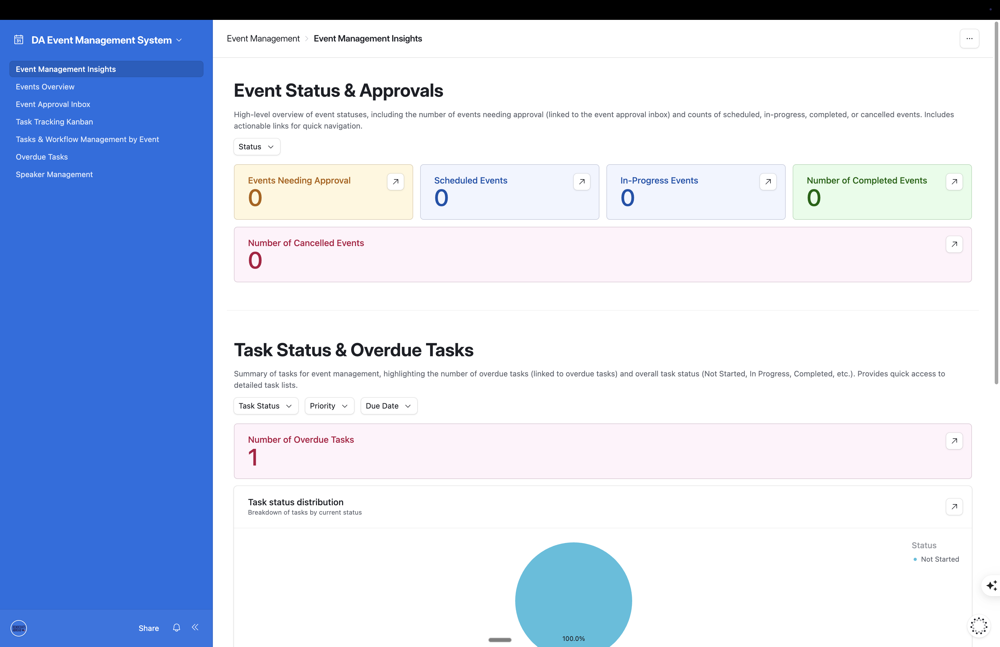
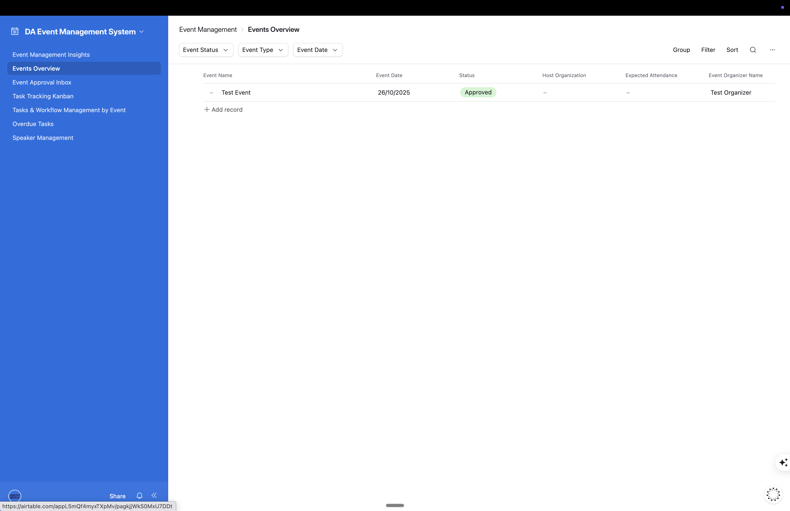
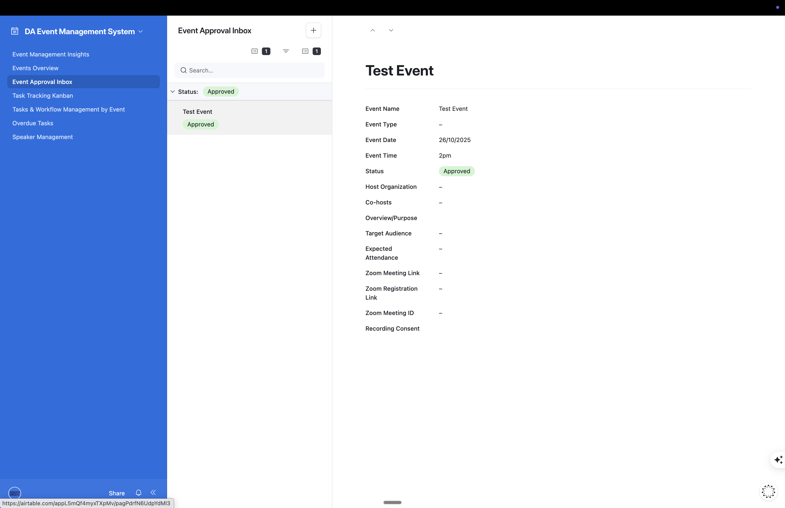
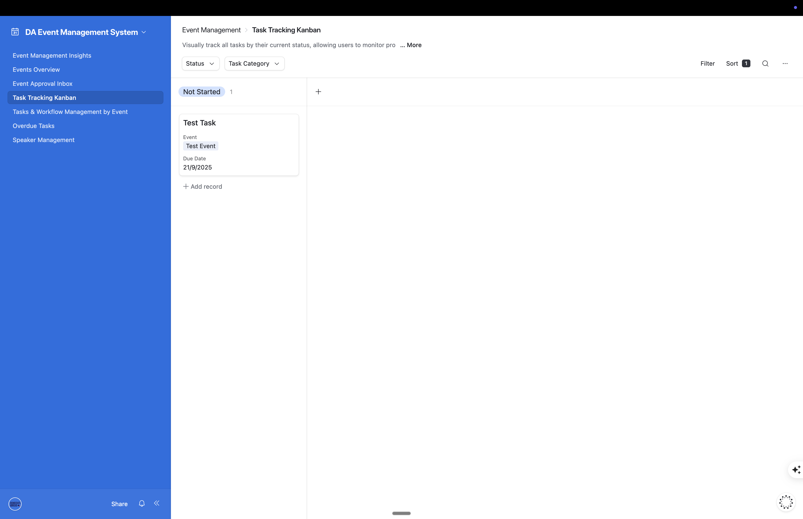
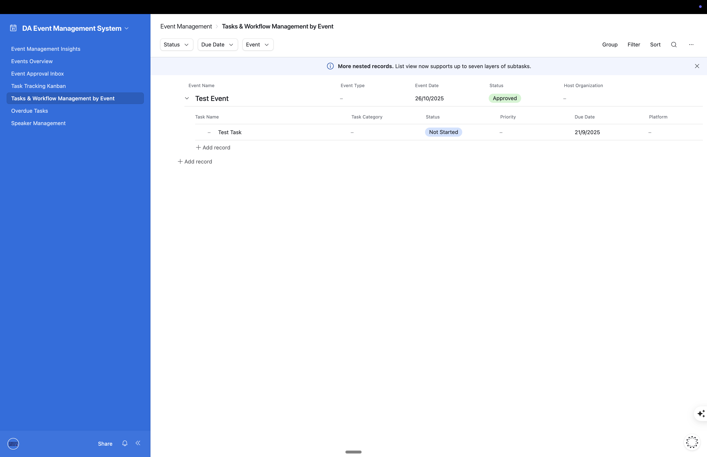
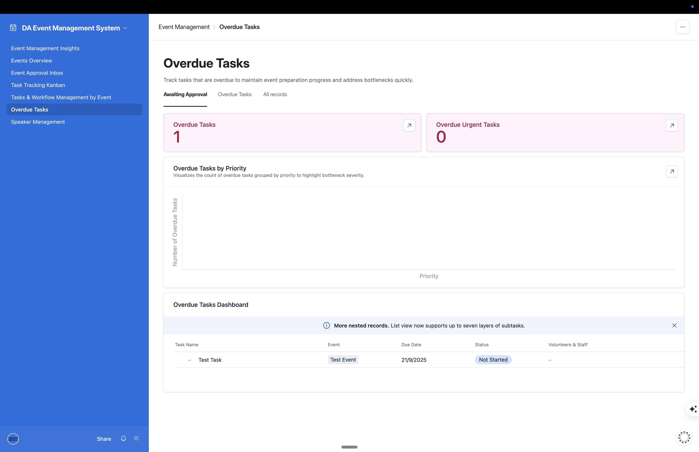

# Democrats Abroad Event Management System

**A comprehensive solution for managing events, speakers, tasks, and volunteers**

---

## Overview

The DA Event Management System is a centralized Airtable-based platform that helps you manage the complete event lifecycle from initial request through post-event follow-up. The system connects events, speakers, tasks, volunteers, and communications in one unified interface.

---

## Key Features

### 📝 Smart Forms

**Event Request Form**
- Simple submission process for event proposals
- Captures organizer details, event information, audience, and speakers
- Automatically creates event records in the system

**Speaker Intake Form**
- Collects speaker bio, photo, contact information, and social media
- Tracks consent for recording and livestreaming
- Captures team member information
- Foreign policy acknowledgment

### 🔗 Connected Data

- Events automatically link to speakers, tasks, and volunteers
- View a speaker's complete event history
- See all tasks for an event in one place
- Track volunteer assignments across events
- Email communication history

### 📊 Visual Dashboard

- Real-time overview of event status and approvals
- Task tracking with Kanban boards
- Calendar views for upcoming events
- Overdue task monitoring
- Speaker database management

---

## How to Use the System

### For Event Organizers

**Submitting an Event Request:**

1. Access the Event Request Form (link provided by coordinator)
2. Complete all required fields:
   - Your contact information
   - Event details (name, type, date, time)
   - Host organization and co-hosts
   - Event overview and target audience
   - Speaker information
3. Submit the form
4. Wait for approval notification (typically 3-5 business days)

**After Approval:**
- The events team will contact you
- Speakers will receive intake forms
- Event will be scheduled and promoted

**Tips:**
- Provide detailed information in the Overview/Purpose field
- Be specific about your target audience
- Confirm speaker availability before submitting
- Give realistic attendance estimates

---

### For Speakers

**Completing the Speaker Intake Form:**

1. You'll receive the form via email after event approval
2. Allow 5-10 minutes to complete
3. Provide the following:
   - Contact information and photo
   - Biography (full and short versions)
   - Social media profiles
   - Recording/livestreaming consent
   - Team member information (if applicable)
   - Topics to avoid
   - Foreign policy acknowledgment

**What Happens Next:**
- Zoom links will be sent closer to the event date
- Run of show provided if needed
- Thank you email after the event

**Tips:**
- Use a professional photo
- Write bio in third person
- Include all social media you want promoted
- Respond promptly to communications

---

### For Event Coordinators

**Daily Workflow:**

**1. Review New Requests**
- Open the Dashboard → Event Management Insights page
- Check "Events Awaiting Approval" section
- Click on events to review complete details

**2. Approve or Request Changes**
- Change Status field:
  - `Approved` - Event is ready to proceed
  - `Draft` - Needs more information (contact organizer)
  - `Cancelled` - Event cancelled

**3. Manage Event Logistics**
- Update Status as event progresses:
  - `Date Reserved` - Date held, details being finalized
  - `Scheduled` - Logistics confirmed, event is public
  - `In Progress` - Event happening now
  - `Completed` - Event finished
- Create and assign tasks
- Track task completion
- Assign volunteers as needed

**4. Track Progress**
- Use Calendar view for upcoming events
- Monitor overdue tasks dashboard
- Update event details as needed
- Track email communications

**Organization Tips:**
- Use the Status field consistently
- Add notes in Special Instructions field
- Keep tasks updated with assignments
- Mark tasks complete as they're done
- Reply to organizers promptly about approvals

---

## Dashboard Interface

### Event Management Insights

Your command center for high-level oversight.



**Key Metrics:**
- Events awaiting approval count
- Scheduled, in-progress, completed, and cancelled event counts
- Overdue task count with priority breakdown
- Task status distribution (pie chart)

---

### Events Overview

Central table view for managing all events.



**Features:**
- Filter by Status, Event Type, and Date
- Sort and group by any field
- Quick add new event records
- View columns: Event Name, Date, Status, Host, Attendance, Organizer

---

### Event Approval Inbox

Streamlined interface for reviewing event requests.



**Features:**
- List view of all pending events
- Detail panel showing complete event information
- Quick status updates
- Recording consent tracking

---

### Task Tracking Kanban

Visual board for managing event tasks by status.



**Columns:**
- Not Started
- In Progress
- Completed
- Blocked
- Cancelled

**Each card shows:**
- Task name
- Associated event
- Due date
- Priority level

---

### Tasks by Event

Hierarchical view showing events with their associated tasks.



**Features:**
- Expandable event rows
- Event details: Name, Type, Date, Status, Host
- Task details: Name, Category, Status, Priority, Due Date
- Add tasks directly to events

---

### Overdue Tasks

Dedicated dashboard for tasks requiring attention.



**Sections:**
- Overdue task count
- Urgent overdue task count
- Priority distribution chart
- Complete task listing with assignments

---

### Speaker Management

Comprehensive interface for managing speakers.


**Features:**
- Filter by Status, Type, and Topics
- View contact information and event history
- Track consent preferences
- Sort by frequency or recent activity

---

## Event Lifecycle

### The Complete Journey

```
1. REQUEST SUBMITTED
   ↓ (Organizer fills out Event Request Form)

2. PENDING APPROVAL
   ↓ (Coordinator reviews in dashboard)

3. APPROVED
   ↓ (Coordinator sends speaker intake forms)
   ↓ (Speakers fill out intake forms)

4. SCHEDULED
   ↓ (Zoom created, logistics confirmed)
   ↓ (Event promoted via email, social media)

5. IN PROGRESS
   ↓ (Event happening now!)

6. COMPLETED
   ↓ (Thank yous sent, recording uploaded)
   ↓ (Survey sent to attendees)
```

### Event Status Meanings

| Status | What It Means | Who Changes It |
|--------|---------------|----------------|
| **Date Reserved** | Date is held, details being finalized | Coordinator |
| **Draft** | Being prepared, not ready for approval | Organizer/Coordinator |
| **Pending Approval** | Waiting for coordinator review | System/Coordinator |
| **Approved** | Ready to proceed with logistics | Coordinator |
| **Scheduled** | Logistics confirmed, event is public | Coordinator |
| **In Progress** | Event is happening now | Coordinator |
| **Completed** | Event finished | Coordinator |
| **Cancelled** | Event cancelled | Coordinator |

---

## System Structure

### 7 Connected Tables

**1. Events Master**
- Complete event information (date, time, description, audience)
- Links to speakers, tasks, volunteers, and committees
- Platform integration tracking (Zoom, NationBuilder, Mighty Networks)
- Email communication history

**2. Speakers**
- Contact information and biography
- Photo and social media profiles
- Consent preferences (recording, livestreaming)
- Event history and frequency
- Specialties and topics

**3. Tasks & Workflow**
- Event-related tasks with assignments
- Due dates and priority levels
- Status tracking (Not Started, In Progress, Completed, Blocked, Cancelled)
- Dependencies between tasks
- Email tracking

**4. Volunteers & Staff**
- Contact information
- Roles and skills
- Language capabilities
- Event and task assignments
- Caucus/committee membership

**5. Committees & Caucuses**
- Organization information
- Event hosting history
- Contact details
- Member count

**6. Email Communications**
- All emails sent for events
- Templates used
- Delivery status
- Open/click tracking

**7. Reports & Analytics**
- Generated reports
- Event performance data
- Speaker and volunteer analytics

---

## Frequently Asked Questions

### For Event Organizers

**Q: How long does approval take?**
A: Usually 3-5 business days. You'll receive an email when your event is approved or if we need more information.

**Q: Can I submit multiple events?**
A: Yes! Submit a separate form for each event.

**Q: What if I don't know the exact speaker yet?**
A: Submit the request with "TBD" or tentative speakers. You can update later.

**Q: What information do I need about my audience?**
A: Include who this event is for, expected attendance size, and why this event would interest them.

---

### For Speakers

**Q: When will I receive the intake form?**
A: After the event is approved, usually 7-10 days before the event.

**Q: Is the photo required?**
A: Yes, we need a photo for promotional materials. You can provide a direct upload or a link to your photo.

**Q: What if I have a team member attending?**
A: Include their name and email in the intake form so they can receive a Zoom panelist link.

**Q: What is the foreign policy acknowledgment?**
A: All DA speakers must acknowledge they won't discuss U.S. foreign policy or criticize non-U.S. governments during official DA events.

---

### For Event Coordinators

**Q: How do I approve an event?**
A: Open the event record and change Status from "Pending Approval" to "Approved".

**Q: How do I send speaker intake forms?**
A: Currently send the form link manually to speakers. Future versions will automate this.

**Q: Can I edit events after submission?**
A: Yes! You can edit any field in any event record at any time.

**Q: How do I create tasks?**
A: Go to Tasks & Workflow table and create a new record, or create from the event record. Future versions will auto-create standard tasks.

**Q: Can I run reports?**
A: Export tables to CSV for analysis. Automated reporting is planned for a future release.

**Q: What if I accidentally delete something?**
A: Airtable has revision history - you can restore deleted records by clicking the record history icon.

---

## Getting Started

### Access the System

**Event Coordinators:**
1. Check your email for the dashboard link
2. Bookmark it for easy access
3. Check daily for new requests and overdue tasks

**Event Organizers:**
1. Use the Event Request Form link provided by your coordinator
2. You'll receive email updates about your event's status

**Speakers:**
1. You'll receive the Speaker Intake Form via email
2. Complete it before the event date

### Important Links

*[Links to be provided by administrator]*
- **Event Request Form:** [URL]
- **Speaker Intake Form:** [URL]
- **Event Coordinator Dashboard:** [URL]

---

## System Requirements

### For All Users
- Internet connection
- Modern web browser (Chrome, Firefox, Safari, Edge)

### For Event Coordinators
- Airtable account (free or paid)

### For Event Organizers & Speakers
- No account needed to submit forms

---

## Support & Training

### Training Available

**For Event Coordinators:**
- Dashboard walkthrough (30 minutes)
- Approval workflow training (15 minutes)
- Task management training (15 minutes)
- Ongoing support as needed

**For Event Organizers:**
- Form submission guide (written documentation)
- Q&A sessions (optional)

**For Speakers:**
- Intake form instructions (included in form)

### Getting Help

**Have a question?**
- Email: [Event Coordinator Email]
- Check this documentation for answers

**Found a bug or have a suggestion?**
- Contact: [System Administrator Email]
- Include screenshots if helpful

---

## Glossary

**Airtable** - Cloud-based database platform that combines spreadsheet and database features

**Base** - An Airtable database (like a collection of related spreadsheets)

**Table** - Similar to a spreadsheet tab, contains records of one type

**Record** - A single row in a table (like one event, one speaker, etc.)

**Field** - A column in a table (like Event Name, Email, etc.)

**View** - A filtered/sorted way of looking at table data

**Interface** - A custom dashboard built on top of tables

**Form** - Web form that creates records in a table

**Link** - Connection between records in different tables

**Status** - The current stage of an event in the workflow

---

## Contact

**Event Coordinator:** [Name and Email]
**System Administrator:** [Name and Email]
**Technical Support:** [Developer Contact]

**System Links:**
- Event Request Form: [URL]
- Speaker Intake Form: [URL]
- Coordinator Dashboard: [URL]
- Technical Documentation: See `TECHNICAL.md`

---

*Last Updated: September 28, 2025*